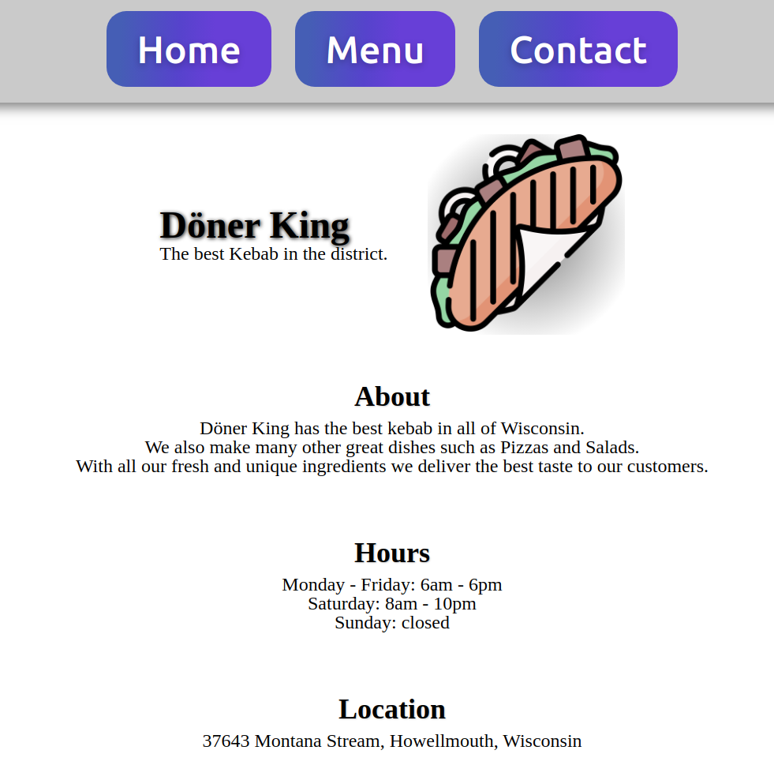

# 🍽️ Restaurant Page

This project is part of **The Odin Project's JavaScript curriculum**, where I created a **Restaurant Page** using **JavaScript**, **HTML**, and **CSS**. The goal of this project was to practice **DOM manipulation** by dynamically rendering the entire content of the restaurant webpage using JavaScript.

## 🌟 Features

- A multi-page-like structure where users can navigate between the **Home**, **Menu**, and **Contact** sections without reloading the page.
- Utilizes **JavaScript modules** to render the webpage content dynamically.
- Basic layout styled with **CSS** to give the page a clean and modern restaurant website look.

## 🚀 Technologies Used

- **HTML5**: For the structure of the webpage.
- **CSS3**: For layout and styling.
- **JavaScript**: To dynamically render the content and handle page navigation.
- **Webpack**: Used to bundle JavaScript modules and manage project dependencies.

## 📸 Preview

You can view the Restaurant application here: [Live Demo](https://mrswizzer.github.io/odin-restaurant-page)

## 💡 Learning Outcomes

Through this project, I gained experience with:

- Using **JavaScript modules** and **Webpack** for better code organization.
- Manipulating the **DOM** to dynamically generate content.
- Managing and structuring a website using **modular components**.
- Enhancing my knowledge of **event listeners** and **JavaScript logic** for creating interactive content.
- Styling and layout techniques in **CSS** to create responsive designs.

---

## 🔗 Acknowledgments

This project was built as part of [The Odin Project](https://www.theodinproject.com/)'s curriculum.
